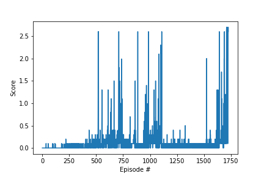

# Project Report

## Learning Algorithm

### Model

**Actor Model:**
- Fully connected layer - Input: state_size (int), Output: 400
- Fully connected layer - Input: 400, Output: 300
- Fully connected layer - Input: 300, Output: action_size (int)
- Dropout with a probability of 0.20 applied after the second hidden layer (fc2).
- Activation function: ReLU for all hidden layers, hyperbolic tangent (tanh) for the output layer.

**Critic Model:**
- Fully connected layer - Input: state_size (int), Output: 400
- Fully connected layer - Input: 400 + action_size (int), Output: 300
- Fully connected layer - Input: 300, Output: 1 (scalar Q-value)
- Dropout with a probability of 0.20 applied after the second hidden layer (fc2).
- Activation function: ReLU for all hidden layers, linear (no activation) for the output layer.

**Weight Initialization:**
- Weight initialization for both models uses the Kaiming initialization (He initialization).
- Bias values are initialized to 0.1.

## Results

### Hyperparameter Tuning Results

The following table summarizes the results from hyperparameter tuning:

| **Model** | **BUFFER_SIZE** | **BATCH_SIZE** | **GAMMA** | **TAU** | **LR_ACTOR** | **LR_CRITIC** | **WEIGHT_DECAY** | **theta** | **sigma** | **Average Training Time** | **Episodes to Solve** | **Average Score at Convergence** | **Average Score** | **Plot** |
|-----------|-----------------|----------------|----------|---------|-------------|--------------|-----------------|----------|----------|---------------------------|----------------------|---------------------------------|-------------------|---------|
| hyper_1   | 1e6 | 128 | 0.99 | 1e-3 | 1e-4 | 1e-3 | 0 | 0.15 | 0.05 | 1293.28 | 271 | 0.05 | 0.015 |  |
| hyper_2   | 1e6 | 128 | 0.99 | 1e-3 | 1e-4 | 1e-3 | 0 | 0.12 | 0.07 | --- | 500 | 0.00 | -0.00 |  |
| hyper_3   | 1e6 | 128 | 0.98 | 1e-3 | 1e-4 | 1e-3 | 0 | 0.15 | 0.07 | 866.90 | 174 | 0.05 | 0.02 |  |
| hyper_4   | 1e6 | 128 | 0.99 | 1e-3 | 1e-4 | 1e-3 | 0 | 0.15 | 0.02 | 458.87 | 50 | 0.05 | 0.015 |  |
| hyper_5   | 1e6 | 128 | 0.99 | 1e-3 | 1e-4 | 1e-3 | 0 | 0.05 | 0.02 | --- | 500 | 0.02 | 0.015 |  |
| hyper_6   | 1e6 | 128 | 0.99 | 1e-2 | 1e-4 | 1e-3 | 0 | 0.15 | 0.05 | --- | 500 | 0.01 | 0.005 |  |

By performing hyperparameter tuning and retraining the model multiple times, I successfully improved the agent's performance. The chosen hyperparameters for the third training session resulted in the fastest training time and achieved the highest average score at convergence, but in the long run it fails to perform. So I am choosing the first set of hyperparameters.

### Final Model

| **Model** | **BUFFER_SIZE** | **BATCH_SIZE** | **GAMMA** | **TAU** | **LR_ACTOR** | **LR_CRITIC** | **WEIGHT_DECAY** | **theta** | **sigma** | **Average Training Time** | **Episodes to Solve** | **Average Score at Convergence** | **Average Score** | **Plot** |
|-----------|-----------------|----------------|----------|---------|-------------|--------------|-----------------|----------|----------|---------------------------|----------------------|---------------------------------|-------------------|---------|
| final   | 1e6 | 128 | 0.99 | 1e-3 | 1e-4 | 1e-3 | 0 | 0.15 | 0.05 | 15336.86 | 1625 | 0.51 | 1.94 |  |

## Ideas for Future Work

1. **Hyperparameter Optimization**: I will continue to explore advanced optimization techniques to fine-tune hyperparameter combinations. This will result in quicker convergence and improved rewards within the environment.

2. **Prioritized Experience Replay**: I plan to implement prioritized experience replay, giving priority to key experiences. This approach will likely accelerate learning process.

3. **Shared Experience Pool and Multi-Agent Learning**: I will delve into a shared experience pool where multiple agents can learn together. This collaborative environment could lead to more sophisticated strategies and interactions.

4. **Exploring Alternative Algorithms**: I am excited to investigate algorithms like MADDPG to address multi-agent challenges. This exploration will open up new possibilities for effective cooperation and competition strategies.

